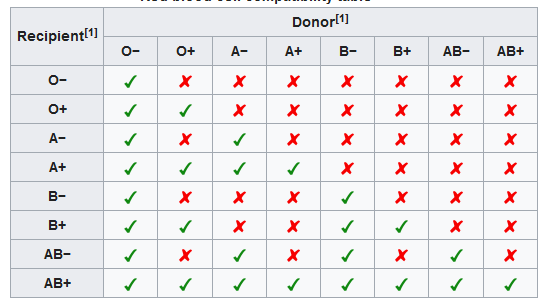
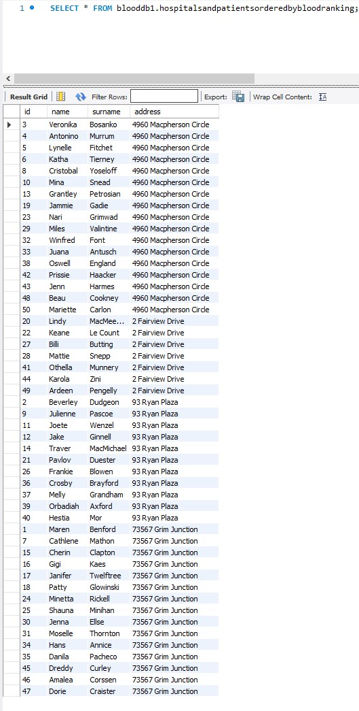

# Blood Transfusion Database Example  with  simple CRUD  App
  
This codebase consists of SQL schemas and example queries of few tables that provides simplified blood/donor/patient/hospital/transfusion  records management  system (Mysql version) and simple CRUD PHP app based on Materialized Views and triggers for CS (Computer Science) education purposes.  

## Project Files
![[Pasted image 20220606033206.png]]
### MySQL version
<ul>
<li>bloodDbSchema-MySql.sql </li>
<li>bloodDbExampleQueries-MySql.sql</li>
<li>bloodDbViewsProcedures-MySql.sql</li>
</ul>

### Postgres version (modified MySQL version)
Designed for blooddb-app (contains DDL DDM DQL TCL commands):

<ul>
<li>bloodDbSchema-Postgres.sql </li>
</ul>

### Blooddb-app
![[Pasted image 20220606033847.png]]

  
##  How to import schema and create query:  

  

### MySql Workbench:  
  
  
  
  

### PGAdmin v4:  
  
  

## How to run blooddb-app

Prerequisites:
<ul>
<li>PHP: 7.4 with Composer</li>
<li>Postgres server: 14 </li>
</ul>
Import schema and run composer init and php server in blooddb-app directory:

![[Pasted image 20220606034621.png]]
![[Pasted image 20220606034656.png]]

# Schema overview

### Mysql Version

### Postgres Version

BloodDb schema consists of:
<ul>
	<li>6 tables</li>
	<li>1 historical table can be generated by "MoveToOldtransfusions" procedure </li>
	<li>6 one to many relations</li>
	<li>2 many to many relations</li>
</ul>

# Tables and relations overview

## Blood

Table represents all possible combinations of antigens and D antibodies of human blood
ABO is the major blood group system and is genetically determined. ABO type depends on  A or B antigens on the red cells. If blood type is O,  cells don’t have either type of antigen.
D is the most important antigen of the Rh (Rhesus) system and it’s also known as RhD.

Blood Ids from this table are assigned to patients and donors.(one to many)

Fields:
<ul>
<li>id - autoincremented PK</li>
<li>type - blood ABO group </li>
<li>isRhesus - true/false value about RhD antigen </li>
<li>fullName - full name of blood type, combines values from "type" and "isRhesus" fields</li>

</ul>

### Blood_Blood

Before transfusion, testing is done between the donated blood and patient to check for compatibility.
Table contains blood group compatibility table :

Table in schema is implemented as many to many relation between same table : "blood"
Technically "blood_blood" table looks like transfer table 

Fields
<ul>
<li>id - autoincremented PK</li>
<li>donorBloodID -  blood id from blood table  (many to many Foregin Key)</li>
<li>patientBloodID -   blood id from blood table (many to many Foregin Key)</li>
<li>isTransferable - stores true/false value with provides info about compatibility between donor and recipient blood </li>
</ul>

### Hospitals

This simple table stores all registered hospitals. All patients and Donors are assigned by one to many relation to the one of hospital. Transfusion table is also connected by the same relation.

Fields
<ul>
<li>id - autoincremented PK</li>
<li>address -  Hospital address</li>
<li>postcode-  Hospital postcode</li>
<li>name - full name of hospital</li>
<li>district -city district of hospital</li>
</ul>

### Patients

Stores data about patients. Table is related with transfusions, hospitals, blood table by one to many relation

Fields
<ul>
<li>id - autoincremented PK</li>
<li>address -  Patient address</li>
<li>postcode-  Patient postcode</li>
<li>surname - Patient surname</li>
<li>name - Patient name</li>
<li>bloodTypeID - assigned blood type id from blood table</li>
<li><b>MySQL Schema only:</b>  recieviedBloodMl - int value of recievied blood in Ml (sum of blood from all transfusions)</li>
<li>telephone number - telephone number</li>
<li>neededBloodMl - float value of neededBlood in Ml </li>
<li>hospitalId - id of assigned hospital</li>
</ul>

### Donors

Stores data about donors. Table is related with transfusions,hospitals, blood table by one to many relation

Fields
<ul>
<li>id - autoincremented PK</li>
<li>address -  donor address</li>
<li>postcode-  donor postcode</li>
<li>surname - donor surname</li>
<li>name - donor name</li>
<li>bloodTypeID -  assigned blood type id from blood table</li>
<li><b>MySQL Schema only:</b> donatedBloodMl - int value of recievied blood in Ml (sum of blood from all transfusions)</li>
<li>telephone number - telephone number</li>
<li>hospitalId - id of assigned hospital</li>
<li><b>MySQL Schema only:</b> isHonoraryDonor - true false value whitch determines if donor is honorary donor (donated blood is equal or higher than 3000 ml )</li>
</ul>

### Transfusions

Holds records about transfusions between patients and donors in specific hospital (one to many ).

<ul>
<li>id - autoincremented PK</li>
<li>patientID - id patient who recievied blood</li>
<li>donorID - id donor who donated blood</li>
<li>hospitalId - id of hospital where transfusion had been done</li>
<li>date - date of transfusion in ' YYYY-MM-DD ' format</li>
<li>bloodTransferedMl - float value of transfered blood during transfusion in Ml</li>
</ul>

By using procedure "MoveToOldtransfusions" as CRON job (executes commands at specific dates and times) transfusion table can behave like a temporary table with the newest records (for ex. recent month). Older transfusions would be stored in old_transfusions table.

### Relations

All mentioned relations with foregin keys are defined below

![[Zrzut ekranu 2022-06-06 032818.jpg]]

# Mock data  generation steps

Dataset was generated using a <a href=" https://www.mockaroo.com/">Mockaroo</a> online random data generator

It can export generated data to CSV, SQL format.
Some tables like "transfusions" needed to be verified for example in terms of blood type compatibility. Also transferred blood and 
"honorary donor" value must be related with data from other tables. It was accomplished by using some alter or delete and some "utility" queries on live database.

Utility Queries (Delete, Update) used to generate consistent dataset :

# Example Queries/Views

<b>1. Select all patients with blood type AB  </b>

<b>2.Select all patients and donors with blood gropup A- and 0+ (union example)</b>

<b>3.Select all patients that begins with 'a'</b>

<b>4. Select all patients from hospital of id 2 that their blood was transfused less than 1500 ml</b>
 

<b>5. Select transfusions and addresses  of hospitals where transfusions had been done between date X to date X</b>

<b>6.Select all transfusions of all hospitals excluding hospital of id 3</b>

<b>7. Select patient name and patient id and hospital address, hospital id of patients assigned hospital in descending order by amount of blood transfered in each hospital  </b>

<b>8. Select hospital address, patient name associated with patient of id 23</b>

<b>9. Select transfusion date, patient name of all patients even if patients didnt had a transfusion (left join example)</b>

<b>10.Select transfusion date, patient name of all patients that had a transfusion  (inner join example)</b>

<b>11. Select transfusion date, patient name of all patients that didnt had a transfusion ( left null join example)</b>

 
 

<b>12. Count how many patients are in every hospital</b>

<b>13. Count how many patients and donors are assigned to hospital of id 3  
(inner join will also work in this example)</b>

<b>14 Count how many patients and donors are assigned to hospital of id 3 with blood type AB+</b>

# Postgres views

### Triggers and functions for refreshing materialized views

